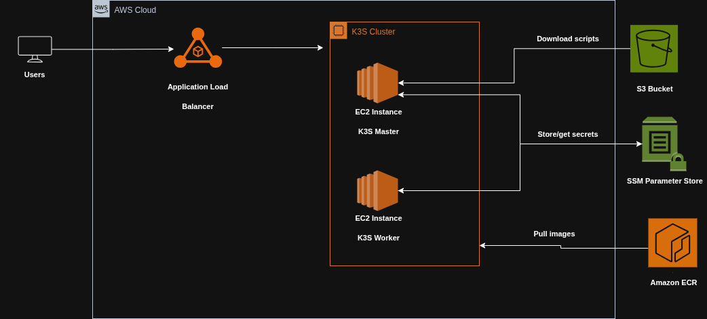

# ☸️ Project 3: Python App on Kubernetes (k3s) with Terraform, Helm & GitHub Actions

This project provisions a **Kubernetes cluster** on AWS EC2 instances using **k3s** and **Terraform**, and deploys a containerized **Python application** via **Helm charts**.
It also sets up **monitoring with Prometheus and Grafana**, automates user creation with read-only permissions, and demonstrates **secure infrastructure automation** using **AWS SSM**.

---

## 📐 Architecture

- **Kubernetes Cluster**
  - EC2 instances running **k3s**
  - Cluster management via **SSM**
  - Kubeconfig and K3s token stored securely in **SSM Parameter Store** for CI/CD access

- **Application Deployment**
  - Python app
  - Deployed via **Helm chart** (`python-chart`)
  - Dockerized and pulled from **ECR**

- **Load Balancing & DNS**
  - **ALB (Application Load Balancer)**
  - **Route53** for custom domain routing

- **Monitoring**
  - **Prometheus** and **Grafana** deployed via Helm
  - Grafana dashboard showing memory usage in the cluster

- **User Management**
  - Bash scripts automate creating **read-only Kubernetes users**
  - Uses S3 and SSM commands to configure access

---

## 🔧 Tech Stack

- **Infrastructure**
  - Terraform (EC2, ALB, Route53, SSM, Parameter Store)
  - k3s Kubernetes cluster

- **Application & Deployment**
  - Python application
  - Docker & ECR
  - Helm charts for app, Prometheus, Grafana
  - GitHub Actions CI/CD for infrastructure and app deployment

- **Monitoring & Logging**
  - Grafana dashboard
  - Prometheus metrics

- **Security**
  - SSM for secure communication with EC2
  - Parameter Store for storing kubeconfig and k3s token
